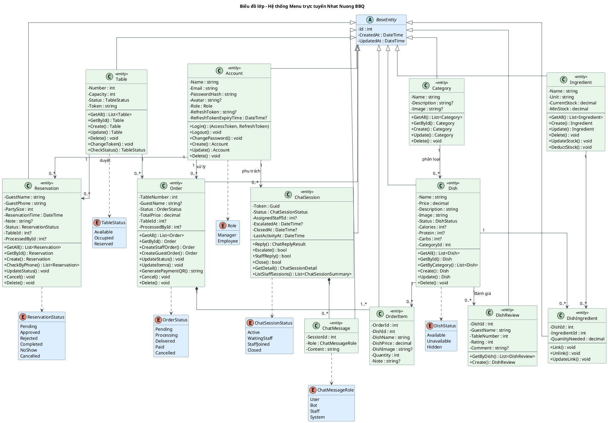

# Biểu đồ lớp — Hệ thống Menu trực tuyến Nhat Nuong BBQ

Tài liệu này mô tả chi tiết biểu đồ lớp (Class Diagram) của hệ thống: các lớp thực thể, thuộc tính, phương thức, kiểu liệt kê (enum) và mối quan hệ giữa chúng.

Hệ thống được xây dựng theo **Clean Architecture** với 4 tầng (`Core` → `Application` → `Infrastructure` → `API`). Các lớp thực thể nằm ở tầng `OnlineMenu.Core/Entities`, là **POCO** (chỉ chứa thuộc tính); phần phương thức trong biểu đồ được mô hình hóa từ các thao tác thực tế trên thực thể đó ở tầng Controller/Service (CRUD + nghiệp vụ) — đúng dạng *design class diagram* dùng cho báo cáo.

---

## 1. Sơ đồ PlantUML

> **Cách xem hình:** dán đoạn mã trên vào [PlantUML Online Server](https://www.plantuml.com/plantuml/uml) hoặc dùng extension *PlantUML* trong VS Code (`Alt+D` để xem trước).

---

## 2. Lớp cơ sở trừu tượng

### `BaseEntity` (abstract)

Lớp cha trừu tượng cho **tất cả** thực thể, cung cấp các trường dùng chung. Mọi thực thể đều kế thừa lớp này, nhờ đó không phải lặp lại 3 trường audit.

| Thuộc tính | Kiểu | Ý nghĩa |
|-----------|------|---------|
| `Id` | int | Khóa chính, tự tăng |
| `CreatedAt` | DateTime | Thời điểm tạo bản ghi (UTC) |
| `UpdatedAt` | DateTime | Thời điểm cập nhật gần nhất (UTC) |

---

## 3. Mô tả chi tiết các lớp thực thể

### 3.1. `Account` — Tài khoản nhân viên

Đại diện cho người dùng nội bộ (Quản lý / Nhân viên). Khách hàng (Guest) **không** có tài khoản.

| Thuộc tính | Kiểu | Ý nghĩa |
|-----------|------|---------|
| `Name` | string | Họ tên nhân viên |
| `Email` | string | Email đăng nhập (duy nhất) |
| `PasswordHash` | string | Mật khẩu đã băm (BCrypt) |
| `Avatar` | string? | Ảnh đại diện (tùy chọn) |
| `Role` | Role | Vai trò: Manager / Employee |
| `RefreshToken` | string? | Token làm mới phiên đăng nhập |
| `RefreshTokenExpiryTime` | DateTime? | Hạn của refresh token |

**Phương thức:** `Login()`, `Logout()`, `ChangePassword()`, `Create()`, `Update()`, `Delete()`.

### 3.2. `Category` — Danh mục món ăn

Nhóm các món ăn theo loại (ví dụ: Đồ nướng, Lẩu, Đồ uống).

| Thuộc tính | Kiểu | Ý nghĩa |
|-----------|------|---------|
| `Name` | string | Tên danh mục |
| `Description` | string? | Mô tả (tùy chọn) |
| `Image` | string? | Ảnh đại diện danh mục |

**Phương thức:** `GetAll()`, `GetById()`, `Create()`, `Update()`, `Delete()`.

### 3.3. `Dish` — Món ăn

Một món trong thực đơn.

| Thuộc tính | Kiểu | Ý nghĩa |
|-----------|------|---------|
| `Name` | string | Tên món |
| `Price` | decimal | Giá bán |
| `Description` | string | Mô tả món |
| `Image` | string | Ảnh món |
| `Status` | DishStatus | Trạng thái: Available / Unavailable / Hidden |
| `Calories` | int? | Năng lượng (tùy chọn) |
| `Protein` | int? | Đạm (tùy chọn) |
| `Carbs` | int? | Tinh bột (tùy chọn) |
| `CategoryId` | int | Khóa ngoại → Category |

**Phương thức:** `GetAll()`, `GetById()`, `GetByCategory()`, `Create()`, `Update()`, `Delete()`.

### 3.4. `DishReview` — Đánh giá món

Đánh giá của khách cho một món (không cần tài khoản).

| Thuộc tính | Kiểu | Ý nghĩa |
|-----------|------|---------|
| `DishId` | int | Khóa ngoại → Dish |
| `GuestName` | string | Tên khách đánh giá |
| `TableNumber` | int | Số bàn khi đánh giá |
| `Rating` | int | Số sao (1–5) |
| `Comment` | string? | Bình luận (tùy chọn) |

**Phương thức:** `GetByDish()`, `Create()`.

### 3.5. `Ingredient` — Nguyên liệu

Nguyên liệu kho dùng để chế biến món.

| Thuộc tính | Kiểu | Ý nghĩa |
|-----------|------|---------|
| `Name` | string | Tên nguyên liệu |
| `Unit` | string | Đơn vị tính (kg, lít, cái, gói…) |
| `CurrentStock` | decimal | Tồn kho hiện tại |
| `MinStock` | decimal | Ngưỡng cảnh báo (stock < min ⇒ cảnh báo) |

**Phương thức:** `GetAll()`, `Create()`, `Update()`, `Delete()`, `UpdateStock()`, `DeductStock()`.

### 3.6. `DishIngredient` — Bảng trung gian Món ↔ Nguyên liệu

Hiện thực hóa quan hệ **N-N** giữa `Dish` và `Ingredient`, đồng thời lưu định mức nguyên liệu cho mỗi món.

| Thuộc tính | Kiểu | Ý nghĩa |
|-----------|------|---------|
| `DishId` | int | Khóa ngoại → Dish |
| `IngredientId` | int | Khóa ngoại → Ingredient |
| `QuantityNeeded` | decimal | Lượng nguyên liệu cần cho 1 phần |

**Phương thức:** `Link()`, `Unlink()`, `UpdateLink()`.

### 3.7. `Order` — Đơn hàng

Một đơn gọi món của bàn.

| Thuộc tính | Kiểu | Ý nghĩa |
|-----------|------|---------|
| `TableNumber` | int | Số bàn đặt món |
| `GuestName` | string? | Tên khách (tùy chọn) |
| `Status` | OrderStatus | Pending / Processing / Delivered / Paid / Cancelled |
| `TotalPrice` | decimal | Tổng tiền |
| `TableId` | int? | Khóa ngoại → Table (có thể null) |
| `ProcessedById` | int? | Khóa ngoại → Account (nhân viên xử lý) |

**Phương thức:** `GetAll()`, `GetById()`, `CreateStaffOrder()`, `CreateGuestOrder()`, `UpdateStatus()`, `UpdateItems()`, `GeneratePaymentQR()`, `Cancel()`, `Delete()`.

### 3.8. `OrderItem` — Chi tiết đơn hàng

Một dòng món trong đơn. Lưu **snapshot** thông tin món tại thời điểm đặt để bảo toàn lịch sử khi món bị sửa/xóa.

| Thuộc tính | Kiểu | Ý nghĩa |
|-----------|------|---------|
| `OrderId` | int | Khóa ngoại → Order |
| `DishId` | int | Khóa ngoại → Dish |
| `DishName` | string | **Snapshot** tên món |
| `DishPrice` | decimal | **Snapshot** giá món |
| `DishImage` | string? | **Snapshot** ảnh món |
| `Quantity` | int | Số lượng |
| `Note` | string? | Ghi chú (tùy chọn) |

### 3.9. `Reservation` — Đặt bàn

Yêu cầu đặt bàn trực tuyến của khách.

| Thuộc tính | Kiểu | Ý nghĩa |
|-----------|------|---------|
| `GuestName` | string | Tên khách |
| `GuestPhone` | string | Số điện thoại |
| `PartySize` | int | Số khách |
| `ReservationTime` | DateTime | Giờ đến dự kiến |
| `Note` | string? | Ghi chú (tùy chọn) |
| `Status` | ReservationStatus | Pending / Approved / Rejected / Completed / NoShow / Cancelled |
| `TableId` | int? | Khóa ngoại → Table (gán khi duyệt) |
| `ProcessedById` | int? | Khóa ngoại → Account (nhân viên duyệt) |

**Phương thức:** `GetAll()`, `GetById()`, `Create()`, `CheckByPhone()`, `UpdateStatus()`, `Cancel()`, `Delete()`.

### 3.10. `Table` — Bàn ăn

Bàn vật lý trong nhà hàng, gắn mã QR.

| Thuộc tính | Kiểu | Ý nghĩa |
|-----------|------|---------|
| `Number` | int | Số bàn |
| `Capacity` | int | Sức chứa |
| `Status` | TableStatus | Available / Occupied / Reserved |
| `Token` | string | Mã GUID xác thực khi quét QR |

**Phương thức:** `GetAll()`, `GetById()`, `Create()`, `Update()`, `Delete()`, `ChangeToken()`, `CheckStatus()`.

### 3.11. `ChatSession` — Phiên hội thoại chatbot

Một phiên chat giữa khách và trợ lý ảo (có thể escalate sang nhân viên).

| Thuộc tính | Kiểu | Ý nghĩa |
|-----------|------|---------|
| `Token` | Guid | Mã định danh phiên cho khách ẩn danh |
| `Status` | ChatSessionStatus | Active / WaitingStaff / StaffJoined / Closed |
| `AssignedStaffId` | int? | Khóa ngoại → Account (nhân viên phụ trách) |
| `EscalatedAt` | DateTime? | Thời điểm yêu cầu gặp nhân viên |
| `ClosedAt` | DateTime? | Thời điểm đóng phiên |
| `LastActivityAt` | DateTime | Hoạt động gần nhất |

**Phương thức:** `Reply()`, `Escalate()`, `StaffReply()`, `Close()`, `GetDetail()`, `ListStaffSessions()`.

### 3.12. `ChatMessage` — Tin nhắn chat

Một tin nhắn trong phiên chat.

| Thuộc tính | Kiểu | Ý nghĩa |
|-----------|------|---------|
| `SessionId` | int | Khóa ngoại → ChatSession |
| `Role` | ChatMessageRole | User / Bot / Staff / System |
| `Content` | string | Nội dung tin nhắn |

---

## 4. Các kiểu liệt kê (Enum)

| Enum | Giá trị | Dùng cho |
|------|---------|----------|
| `Role` | Manager, Employee | Phân quyền `Account` |
| `DishStatus` | Available, Unavailable, Hidden | Trạng thái `Dish` |
| `OrderStatus` | Pending, Processing, Delivered, Paid, Cancelled | Vòng đời `Order` |
| `ReservationStatus` | Pending, Approved, Rejected, Completed, NoShow, Cancelled | Vòng đời `Reservation` |
| `TableStatus` | Available, Occupied, Reserved | Trạng thái `Table` |
| `ChatSessionStatus` | Active, WaitingStaff, StaffJoined, Closed | Vòng đời `ChatSession` |
| `ChatMessageRole` | User, Bot, Staff, System | Người gửi `ChatMessage` |

---

## 5. Mối quan hệ giữa các bảng

| # | Quan hệ | Loại | Khóa ngoại | Bắt buộc? |
|---|---------|------|-----------|-----------|
| 1 | Category → Dish | 1 — N | `Dish.CategoryId` | Có |
| 2 | Dish → OrderItem | 1 — N | `OrderItem.DishId` | Có |
| 3 | Dish → DishReview | 1 — N | `DishReview.DishId` | Có |
| 4 | Dish ↔ Ingredient | N — N | qua `DishIngredient` | Có |
| 5 | Order → OrderItem | 1 — N (composition) | `OrderItem.OrderId` | Có |
| 6 | Table → Order | 1 — N | `Order.TableId` | Tùy chọn (null) |
| 7 | Table → Reservation | 1 — N | `Reservation.TableId` | Tùy chọn (null) |
| 8 | Account → Order | 1 — N | `Order.ProcessedById` | Tùy chọn (null) |
| 9 | Account → Reservation | 1 — N | `Reservation.ProcessedById` | Tùy chọn (null) |
| 10 | Account → ChatSession | 1 — N | `ChatSession.AssignedStaffId` | Tùy chọn (null) |
| 11 | ChatSession → ChatMessage | 1 — N (composition) | `ChatMessage.SessionId` | Có |

### Giải thích theo nhóm

**🍽️ Nhóm thực đơn**

- **Category → Dish (1 — N):** Một danh mục chứa nhiều món; mỗi món thuộc đúng một danh mục (`Dish.CategoryId` bắt buộc).
- **Dish ↔ Ingredient (N — N qua `DishIngredient`):** Một món cần nhiều nguyên liệu, một nguyên liệu dùng cho nhiều món. Bảng trung gian còn lưu `QuantityNeeded` để **tự động trừ kho** khi bán món.

**🧾 Nhóm gọi món**

- **Order → OrderItem (composition ◆):** Một đơn gồm nhiều dòng chi tiết; `OrderItem` không tồn tại độc lập — xóa đơn thì xóa luôn chi tiết.
- **Dish → OrderItem (1 — N):** Một món xuất hiện trong nhiều dòng đơn. `OrderItem` lưu **snapshot** nên đơn cũ vẫn đúng dù món bị sửa/xóa sau này.
- **Table → Order (1 — N):** Một bàn có nhiều đơn theo thời gian. `Order.TableId` null được vì đơn có thể tạo chỉ bằng `TableNumber` (khách quét QR).
- **Account → Order (1 — N):** Một nhân viên xử lý nhiều đơn. Null khi khách tự đặt, chưa có người tiếp nhận.

**📅 Nhóm đặt bàn**

- **Table → Reservation (1 — N):** Một bàn nhận nhiều lượt đặt. `Reservation.TableId` null khi khách mới gửi yêu cầu, bàn được gán lúc nhân viên duyệt.
- **Account → Reservation (1 — N):** Một nhân viên duyệt nhiều lượt đặt. Null khi còn chờ duyệt.

**⭐ Đánh giá**

- **Dish → DishReview (1 — N):** Một món nhận nhiều đánh giá từ khách.

**💬 Nhóm chatbot**

- **ChatSession → ChatMessage (composition ◆):** Một phiên chứa nhiều tin nhắn; xóa phiên thì xóa toàn bộ tin nhắn.
- **Account → ChatSession (1 — N):** Một nhân viên phụ trách nhiều phiên hỗ trợ. `AssignedStaffId` null khi khách còn chat với bot, chưa escalate.

---

## 6. Hai điểm thiết kế đáng chú ý

1. **Khóa ngoại tùy chọn (nullable):** `TableId`, `ProcessedById`, `AssignedStaffId` đều cho phép null — phản ánh đúng nghiệp vụ: khách **tự khởi tạo** đơn/đặt bàn/chat trước, nhân viên hoặc bàn được gán **sau** trong quá trình xử lý.

2. **Composition vs Association:** Chỉ `Order → OrderItem` và `ChatSession → ChatMessage` là composition (◆ — sống chết theo cha). Các quan hệ còn lại là association thường (hai bên tồn tại độc lập — ví dụ xóa một đơn không xóa món trong thực đơn).

3. **Snapshot trong `OrderItem`:** Các trường `DishName`, `DishPrice`, `DishImage` được sao chép tại thời điểm đặt, giúp đơn hàng lịch sử luôn chính xác kể cả khi món gốc thay đổi giá hoặc bị xóa khỏi thực đơn.
